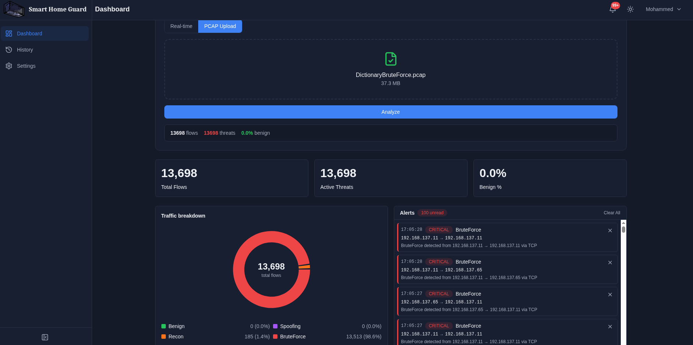
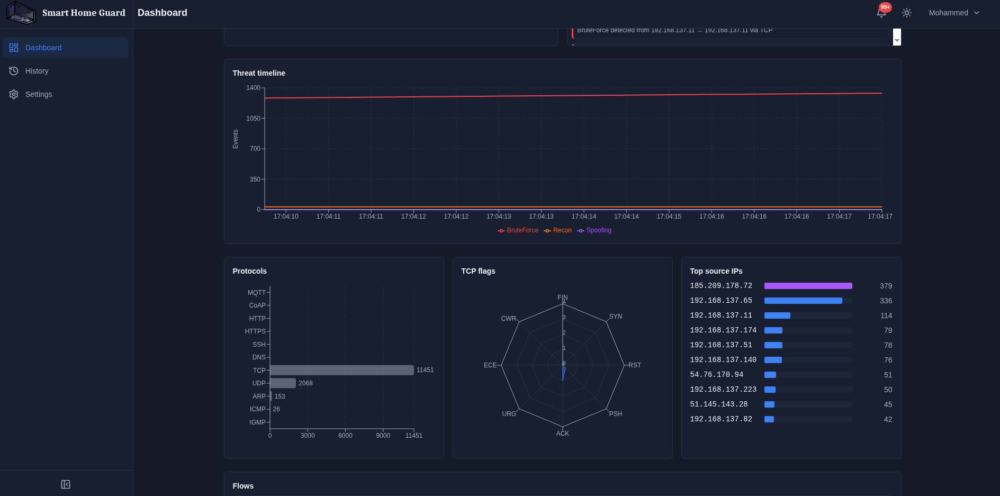
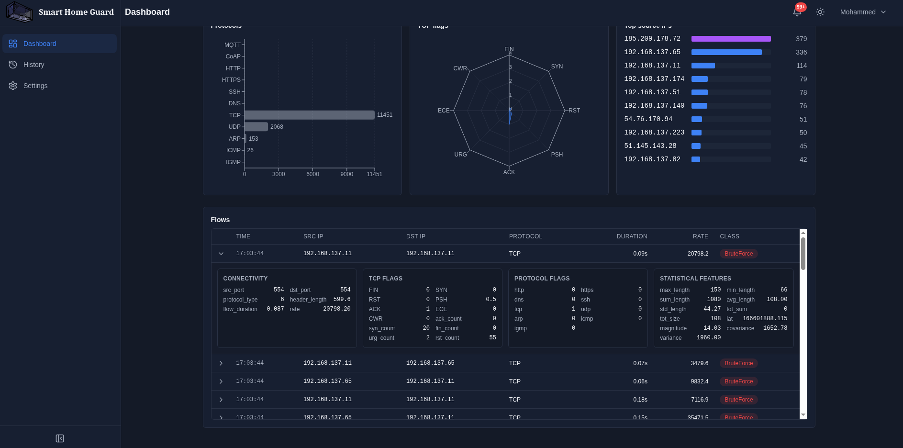
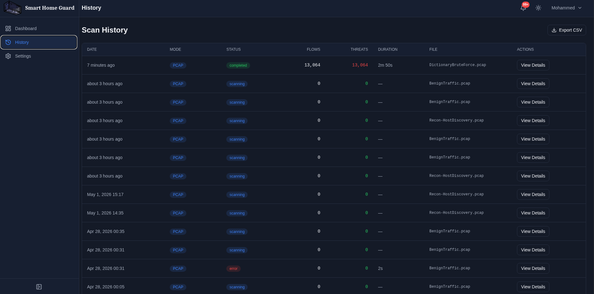
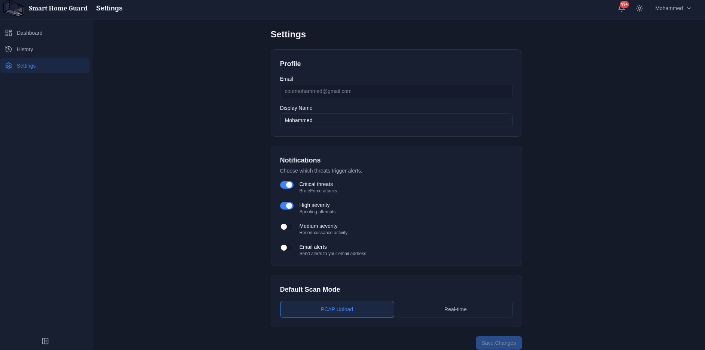

# SmartHomeGuard

A machine-learning-driven intrusion detection system for smart-home / IoT networks. SmartHomeGuard ingests network traffic — either from an uploaded PCAP file or a live network interface — extracts 35 statistical and protocol-level features per flow, and classifies each flow into one of four categories using a LightGBM model trained on the CIC-IoT dataset:

- **Benign** — normal traffic
- **BruteForce** — (critical severity)
- **Spoofing** — (high severity)
- **Recon** — (medium severity)

The system surfaces results through a real-time React dashboard with live KPIs, threat timelines, protocol breakdowns, alert feeds, and a persistent scan history backed by Supabase.


## Project Structure

```
smart_home_guard/
├── backend/                      # FastAPI service
│   ├── main.py                   # App factory, lifespan loads ML artifacts
│   ├── routers/
│   │   ├── analysis.py           # POST /api/analyze
│   │   ├── scan.py               # POST /api/scan/{start,stop}, interfaces
│   │   └── health.py             # GET /api/health
│   ├── services/
│   │   ├── ml_service.py         # LightGBM inference wrapper
│   │   ├── feature_service.py    # PCAP → 35-feature DataFrame
│   │   └── supabase_client.py    # Service-role client
│   ├── models/                   # Pydantic schemas + enums
│   ├── middleware/auth.py        # Supabase JWT verification
│   └── Dockerfile
│
├── frontend/                     # React + Vite SPA
│   └── src/
│       ├── pages/                # DashboardPage, HistoryPage, SettingsPage, LoginPage
│       ├── components/           # dashboard/, scan/, history/, layout/, ui/
│       ├── hooks/                # useAuth, useUploadAnalysis, useRealtimeFlows, ...
│       ├── services/             # api.ts (axios), analysisService, supabaseService
│       ├── store/                # Zustand: scan, alerts, theme, ui
│       ├── types/                # ml, flow, scan, alert
│       └── lib/                  # supabase client, queryClient, constants
│
├── utils/pcap2csv/               # Feature extraction pipeline (35 features/flow)
│
├── notebooks/                    # Model training & EDA
│   ├── models/                   # Trained artifacts (lightgbm.txt deployed)
│   ├── training.ipynb            # LightGBM/XGBoost/CatBoost
│   └── exploratory_data_analysis.ipynb
│
├── supabase/migrations/          # SQL schema (scan_sessions, flow_events, alerts, user_preferences) + RLS
├── tests/
├── pyproject.toml                # Backend deps (managed by uv)
└── README.md
```

## Screenshots

### Dashboard





### Scan History



### Settings



## Installation & Setup

### Prerequisites
- **Python** 3.12 (`<3.13`)
- **Node.js** 20+
- **uv** — `curl -LsSf https://astral.sh/uv/install.sh | sh`
- A **Supabase** project (free tier is fine) — you'll need its URL, anon key, service-role key, and JWT secret
- **tcpdump** (only needed for live capture mode): `sudo apt install tcpdump` / `sudo dnf install tcpdump`

### 1. Clone & enter the repo
```bash
git clone <your-fork-url> smart_home_guard
cd smart_home_guard
```

### 2. Provision Supabase
Apply the schema (creates the four tables + RLS policies + Realtime publication):
```bash
# Via Supabase CLI
supabase db push

# OR copy/paste supabase/migrations/*.sql into the Supabase SQL Editor.
```

### 3. Backend
```bash
# Install Python deps into a managed venv
uv sync

# Configure environment
cp backend/.env.example backend/.env
# Edit backend/.env with your Supabase credentials:
#   SUPABASE_URL=https://<project>.supabase.co
#   SUPABASE_SERVICE_KEY=...
#   SUPABASE_JWT_SECRET=...
#   ALLOWED_ORIGINS=http://localhost:5173

# Run the API (loads Model + scaler + label encoder at startup)
uv run uvicorn backend.main:app --reload --host 0.0.0.0 --port 8000
```

Health check: `curl http://localhost:8000/api/health` — should report `model_loaded: true`.

### 4. Frontend
```bash
cd frontend
npm install

# Configure
cp .env.example .env
# Edit .env:
#   VITE_SUPABASE_URL=https://<project>.supabase.co
#   VITE_SUPABASE_ANON_KEY=...
#   VITE_API_BASE_URL=http://localhost:8000

npm run dev
# Open http://localhost:5173
```

### 5. Try it out
1. Register an account on the login page.
2. Drop a `.pcap` file in the **PCAP Upload** panel (sample captures from CIC-IoT or tcpdump output work).
3. Watch flows stream into the dashboard — donut, timeline, alerts and flow table all update in real time.
4. Visit **History** to revisit past sessions.

### Docker (backend only)
```bash
docker build -t smart-home-guard-backend -f backend/Dockerfile .
docker run --rm -p 8000:8000 --env-file backend/.env smart-home-guard-backend
```
Live capture inside Docker requires `--cap-add=NET_RAW --cap-add=NET_ADMIN` and a host-network interface.

## Contributors

- Mohammed Alhamad
- Hisham Almohaimeed
- Abdullah Altamimi
- Abdulaziz Alsheikh

---